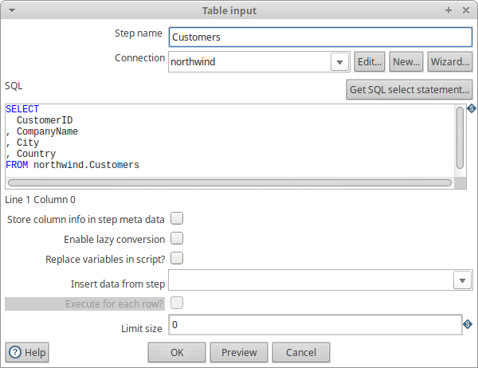
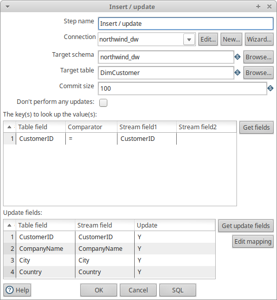
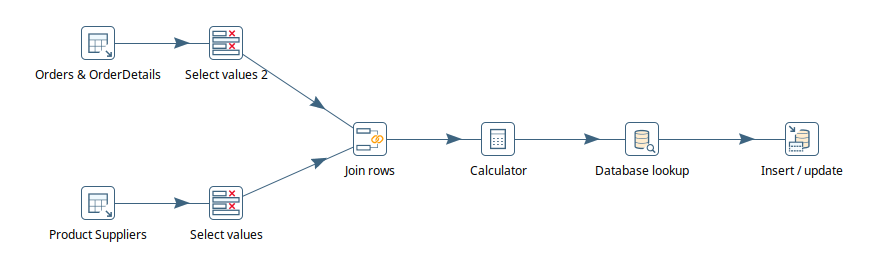

# Report

## Present the SQL instructions to create the data warehouse tables

The codeshould be formatted and indented in a way that makes it easy to read for a human.

[northwind_dw.sql](../sql/northwind_dw.sql)

## Transformations & Jobs

### [DimCustomer](../etl/DimCustomer.ktr)

#### Table Input

#### Insert/Update

### [DimShipper](../etl/DimShipper.ktr)

### [DimSupplier](../etl/DimSupplier.ktr)

### [DimTime](../etl/DimTime.ktr)

### [DimProduct](../etl/DimProduct.ktr)

### [FactOrder](../etl/FactOrder.ktr)

### Job to Populate the Data Warehouse

## Present the XML code for the cube definition. The code should be formatted and indented in a way that makes it easy to read for a human

[XML code](../olap/northwind_dw.xml)

## For each analysis query that you develop in Saiku, present one of the following

If you developed the query bydrag-and-drop, present a screenshot of the Saiku user interface, showing the measures, columns, rows and filters used in the query, together with the query results.
•If you developed the query in MDX mode, present the MDX code together with **a screenshot of the query results**.

1. [Customer country and year](../analysis/customer-country-year.md)
2. [Product category and year](../analysis/product-category-year.md)
3. [Shipping company and year](../analysis/shipping-company-year.md)
4. [Customer country and product category](../analysis/customer-country-product-category.md)
5. [Supplier country and customer country](../analysis/supplier-country-customer-country.md)
6. [Product category and shipping company](../analysis/product-category-shipping-company.md)
