# Report

## SQL Instructions to Create the Data Warehouse Tables

```sql
DROP DATABASE IF EXISTS northwind_dw;

CREATE DATABASE northwind_dw;

USE northwind_dw;

CREATE TABLE DimCustomer (
    CustomerID VARCHAR(5),
    CompanyName VARCHAR(40) NOT NULL,
    City VARCHAR(15),
    Country VARCHAR(15),
    PRIMARY KEY (CustomerID)
);

CREATE TABLE DimProduct (
    ProductSurrogateID INTEGER,
    ProductID INTEGER,
    ProductName VARCHAR(40),
    CategoryName VARCHAR(15),
    Version INTEGER NOT NULL,
    DateFrom DATETIME,
    DateTo DATETIME,
    PRIMARY KEY (ProductSurrogateID)
);

CREATE TABLE DimSupplier (
    SupplierID INTEGER,
    CompanyName VARCHAR(40) NOT NULL,
    City VARCHAR(15),
    Country VARCHAR(15),
    PRIMARY KEY (SupplierID)
);

CREATE TABLE DimShipper (
    ShipperID INTEGER,
    CompanyName VARCHAR(40) NOT NULL,
    PRIMARY KEY (ShipperID)
);

CREATE TABLE DimTime (
    TimeID DATE,
    YearID INTEGER NOT NULL,
    MonthID INTEGER NOT NULL,
    MonthName CHAR(3) NOT NULL,
    DayID INTEGER NOT NULL,
    PRIMARY KEY (TimeID)
);

CREATE TABLE FactOrder (
    OrderID INTEGER,
    ProductID INTEGER,
    UnitPrice DECIMAL(10,4) NOT NULL,
    Quantity SMALLINT(2) NOT NULL,
    Discount REAL NOT NULL,
    TotalCost DOUBLE NOT NULL,
    CustomerID VARCHAR(5) NOT NULL,
    ProductSurrogateID INTEGER NOT NULL,
    SupplierID INTEGER NOT NULL,
    ShipperID INTEGER NOT NULL,
    TimeID DATE NOT NULL,
    CONSTRAINT PK_FactOrder PRIMARY KEY (OrderID, ProductID),
    FOREIGN KEY (CustomerID) REFERENCES DimCustomer (CustomerID),
    FOREIGN KEY (ProductSurrogateID) REFERENCES DimProduct (ProductSurrogateID),
    FOREIGN KEY (SupplierID) REFERENCES DimSupplier (SupplierID),
    FOREIGN KEY (ShipperID) REFERENCES DimShipper (ShipperID),
    FOREIGN KEY (TimeID) REFERENCES DimTime (TimeID)
);
```

## Transformations & Jobs

For readability purposes, all preview results have been limited to 10 rows if 10 or more rows exist.

---

### [Customer Dimension](../etl/DimCustomer.ktr)

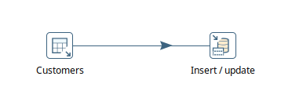

Table Input


Insert/Update


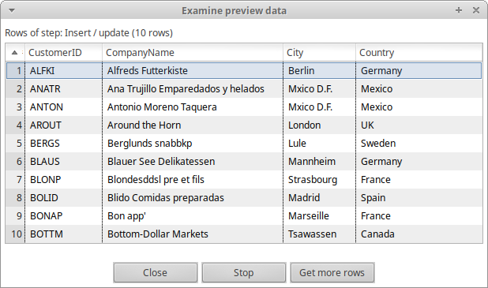

---

### [Shipper Dimension](../etl/DimShipper.ktr)


Table Input


Insert/Update

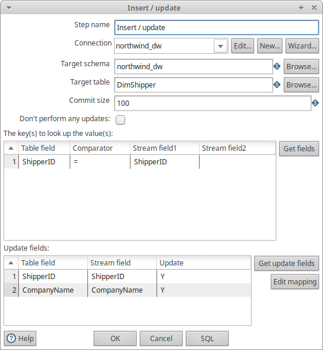


---

### [Supplier Dimension](../etl/DimSupplier.ktr)

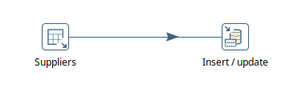

Table Input


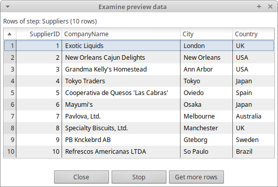

Insert/Update


---

### [Time Dimension](../etl/DimTime.ktr)


Table Input


Calculator


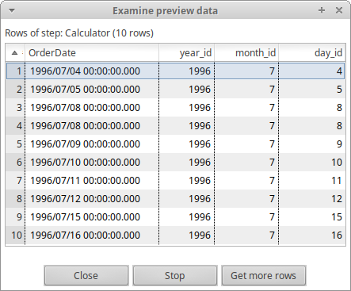

Value Mapper


Insert/Update


---

### [Product Dimension](../etl/DimProduct.ktr)


Table Input (1)


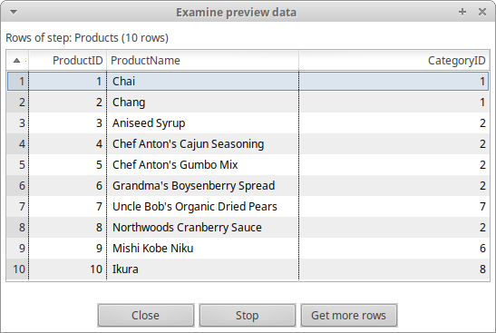

Select Values (1)


Table Input (2)


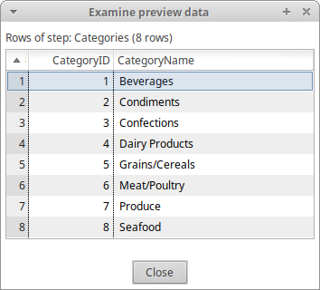

Select Values (2)


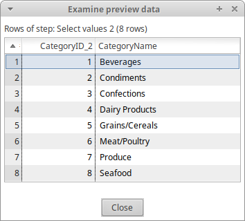

Join Rows


Dimension Lookup/Update

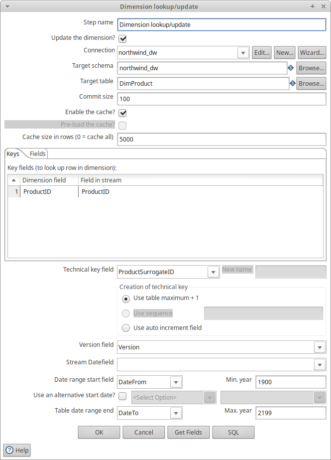


---

### [Orders Fact Table](../etl/FactOrder.ktr)


Table Input (1)


Select Values (1)


Table Input (2)

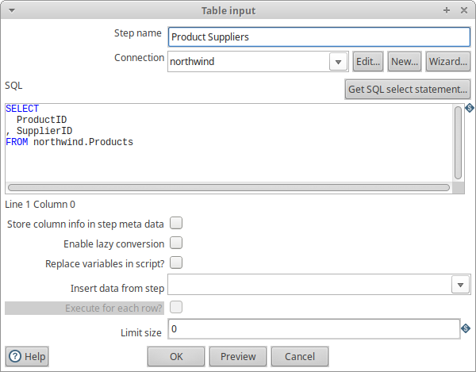


Select Values (2)


Join Rows

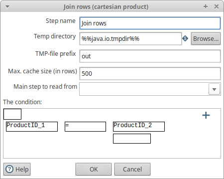


Calculator


Database Lookup


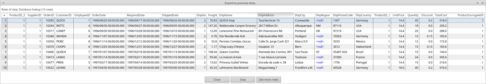

Insert/Update


---

### [Job to Populate the Data Warehouse](../etl/LoadDw.kjb)

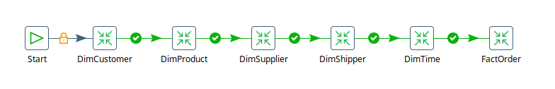

## XML OLAP Cube Definition

```xml
<Schema name="northwind_dw">
  <Cube name="Orders" visible="true" cache="true" enabled="true">
    <Table name="FactOrder">
    </Table>
    <Dimension type="StandardDimension" visible="true" foreignKey="CustomerID" highCardinality="false" name="Customer">
      <Hierarchy name="Customer Hierarchy" visible="true" hasAll="true" allMemberName="All Customers" primaryKey="CustomerID">
        <Table name="DimCustomer">
        </Table>
        <Level name="Country" visible="true" column="Country" type="String" uniqueMembers="false" levelType="Regular" hideMemberIf="Never">
        </Level>
        <Level name="City" visible="true" column="City" type="String" uniqueMembers="false" levelType="Regular" hideMemberIf="Never">
        </Level>
        <Level name="Company Name" visible="true" column="CompanyName" type="String" uniqueMembers="false" levelType="Regular" hideMemberIf="Never">
        </Level>
      </Hierarchy>
    </Dimension>
    <Dimension type="StandardDimension" visible="true" foreignKey="ProductSurrogateID" highCardinality="false" name="Product">
      <Hierarchy name="Product Hierarchy" visible="true" hasAll="true" allMemberName="All Products" primaryKey="ProductSurrogateID">
        <Table name="DimProduct">
        </Table>
        <Level name="Category Name" visible="true" column="CategoryName" type="String" uniqueMembers="false" levelType="Regular" hideMemberIf="Never">
        </Level>
        <Level name="Product Name" visible="true" column="ProductName" type="String" uniqueMembers="false" levelType="Regular" hideMemberIf="Never">
        </Level>
      </Hierarchy>
    </Dimension>
    <Dimension type="StandardDimension" visible="true" foreignKey="SupplierID" highCardinality="false" name="Supplier">
      <Hierarchy name="Supplier Hierarchy" visible="true" hasAll="true" allMemberName="All Suppliers" primaryKey="SupplierID">
        <Table name="DimSupplier">
        </Table>
        <Level name="Country" visible="true" column="Country" type="String" uniqueMembers="false" levelType="Regular" hideMemberIf="Never">
        </Level>
        <Level name="City" visible="true" column="City" type="String" uniqueMembers="false" levelType="Regular" hideMemberIf="Never">
        </Level>
        <Level name="Company Name" visible="true" column="CompanyName" type="String" uniqueMembers="false" levelType="Regular" hideMemberIf="Never">
        </Level>
      </Hierarchy>
    </Dimension>
    <Dimension type="StandardDimension" visible="true" foreignKey="ShipperID" highCardinality="false" name="Shipper">
      <Hierarchy name="Shipper Hierarchy" visible="true" hasAll="true" allMemberName="All Shippers" primaryKey="ShipperID">
        <Table name="DimShipper">
        </Table>
        <Level name="Company Name" visible="true" column="CompanyName" type="String" uniqueMembers="false" levelType="Regular" hideMemberIf="Never">
        </Level>
      </Hierarchy>
    </Dimension>
    <Dimension type="TimeDimension" visible="true" foreignKey="TimeID" highCardinality="false" name="Time">
      <Hierarchy name="Time Hierarchy" visible="true" hasAll="true" allMemberName="All Years" primaryKey="TimeID">
        <Table name="DimTime">
        </Table>
        <Level name="Year" visible="true" column="YearID" type="Integer" uniqueMembers="false" levelType="TimeYears" hideMemberIf="Never">
        </Level>
        <Level name="Month" visible="true" column="MonthName" ordinalColumn="MonthID" type="String" uniqueMembers="false" levelType="TimeMonths" hideMemberIf="Never">
        </Level>
        <Level name="Day" visible="true" column="DayID" type="Integer" uniqueMembers="false" levelType="TimeDays" hideMemberIf="Never">
        </Level>
      </Hierarchy>
    </Dimension>
    <Measure name="Sales" column="TotalCost" datatype="Numeric" formatString="$ #,###.00" aggregator="sum" visible="true">
    </Measure>
    <Measure name="Quantity" column="Quantity" datatype="Integer" formatString="#,###" aggregator="sum" visible="true">
    </Measure>
  </Cube>
</Schema>
```

## Analysis Queries

### a) [Analyze sales by customer country and year to discover the country, the year, and the pair country-year with the most sales](../analysis/customer-country-year.md)

Customer country with most sales


Year with most sales


Customer country and year pair with most sales


### b) [Analyze sales by product category and year to discover the category, the year, and the pair category-year with the most sales](../analysis/product-category-year.md)

Product category with most sales


Year with most sales


Product category and year pair with most sales


### c) [Analyze quantity by shipping company and year to discover the shipper, the year, and the pair shipper-year with the most quantity](../analysis/shipping-company-year.md)

Shipping company with the most quantity shipped


Year with the most quantity shipped


Shipping company and year pair with the most quantity shipped


### d) [Analyze sales by customer country and product category to identify the pairs of country-category with no sales at all](../analysis/customer-country-product-category.md)

Customer country and category pairs with no sales


### e) [Analyze quantity by supplier country and customer country to identify the pairs of countries with no quantities being shipped between them](../analysis/supplier-country-customer-country.md)

Country pairs with no quantity shipped: the first column represents the country shipped from,
i.e., the supplier's country; the second column represents the country shipped to,
i.e., the customer's country.


### f) [Analyze quantity by product category and shipping company to identify the pairs of category-shipper with no quantity at all](../analysis/product-category-shipping-company.md)

Category-shipper pairs with no quantity


The table is empty, which means there was no product category which had not been
shipped by any shipping company registered.
This can be confirmed by executing the following query:

TODO: insert mdx query


The table has no empty cells, therefore all categories have been shipped by all shipping companies.

## Appendix

For additional information, developed code can be found
[here](https://github.com/vladstojna/dot-files-3).
