# Report

## SQL Instructions to Create the Data Warehouse Tables

[northwind_dw.sql](../sql/northwind_dw.sql)

## Transformations & Jobs

For readability purposes, all preview results have been limited to 10 rows if 10 or more rows exist.

### [Customer Dimension](../etl/DimCustomer.ktr)

Table Input

Insert/Update

### [Shipper Dimension](../etl/DimShipper.ktr)

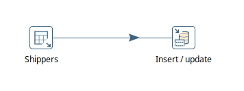

Table Input

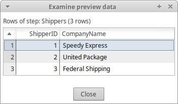

Insert/Update

### [Supplier Dimension](../etl/DimSupplier.ktr)

Table Input

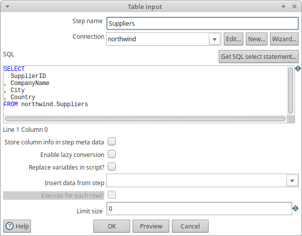

Insert/Update

### [Time Dimension](../etl/DimTime.ktr)

Table Input

Calculator

Value Mapper

Insert/Update

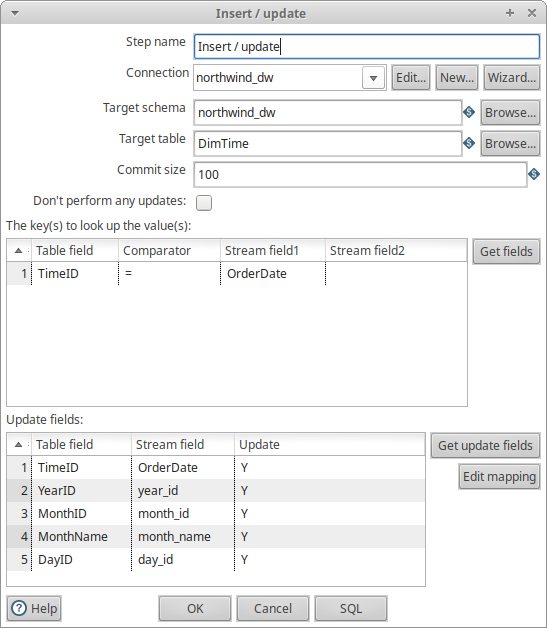

### [Product Dimension](../etl/DimProduct.ktr)

Table Input (1)

Select Values (1)

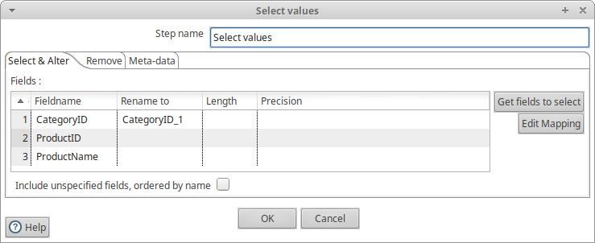
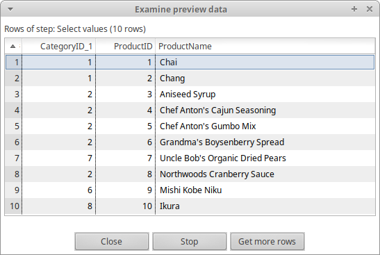

Table Input (2)

Select Values (2)

Join Rows

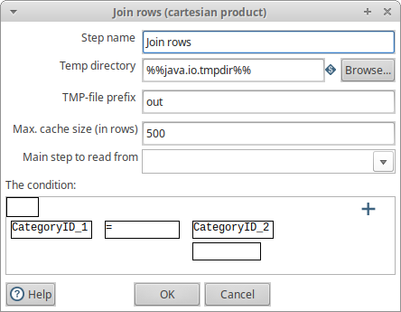

Dimension Lookup/Update

### [Orders Fact Table](../etl/FactOrder.ktr)

Table Input (1)

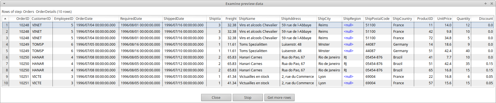

Select Values (1)

Table Input (2)

Select Values (2)

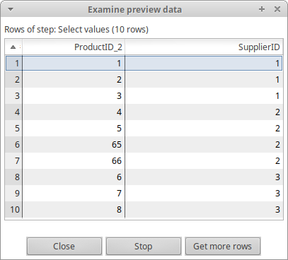

Join Rows

Calculator

Database Lookup

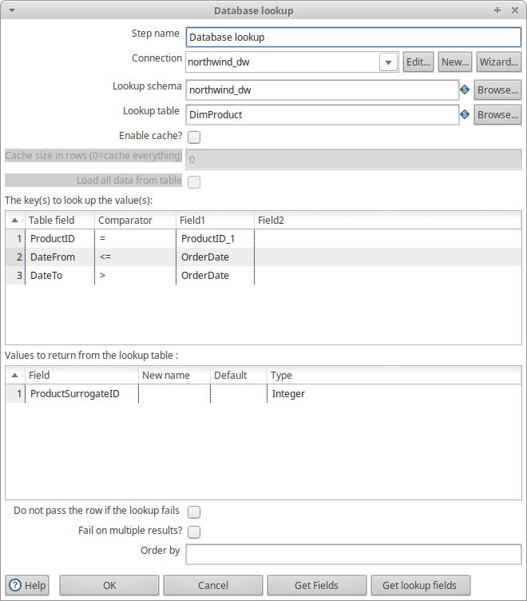

Insert/Update

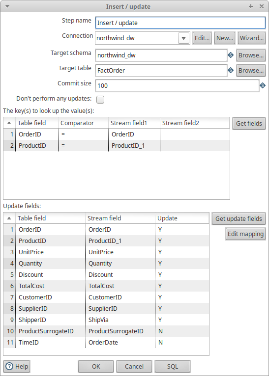

### [Job to Populate the Data Warehouse](../etl/LoadDw.kjb)

## XML OLAP Cube Definition

[XML code](../olap/northwind_dw.xml)

## Analysis Queries

1. [Customer country and year](../analysis/customer-country-year.md)
2. [Product category and year](../analysis/product-category-year.md)
3. [Shipping company and year](../analysis/shipping-company-year.md)
4. [Customer country and product category](../analysis/customer-country-product-category.md)
5. [Supplier country and customer country](../analysis/supplier-country-customer-country.md)
6. [Product category and shipping company](../analysis/product-category-shipping-company.md)
